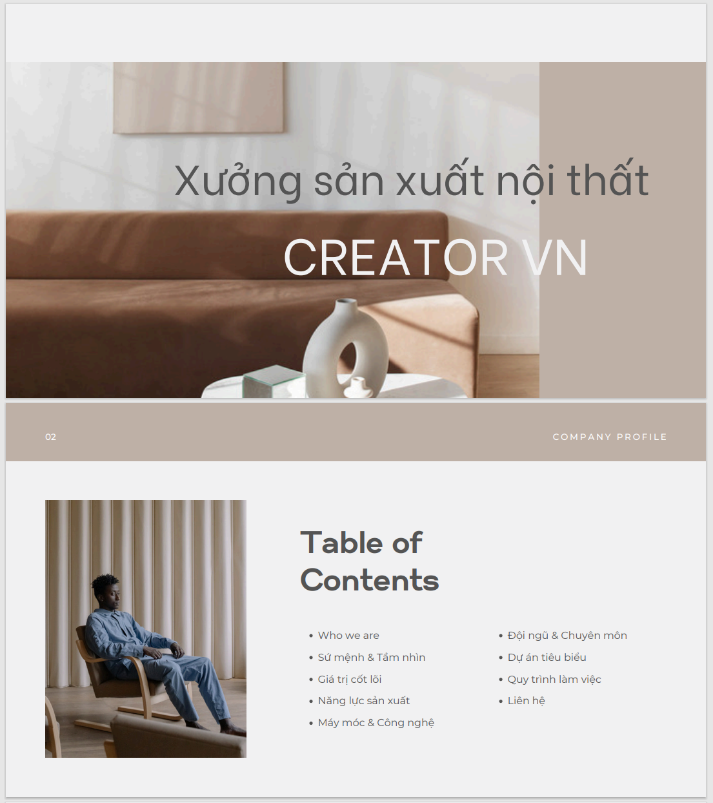
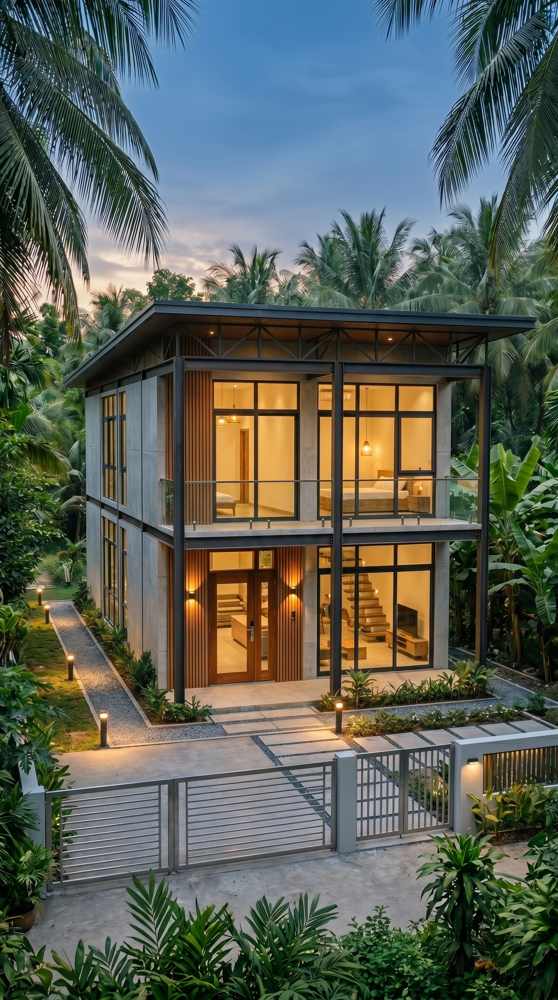
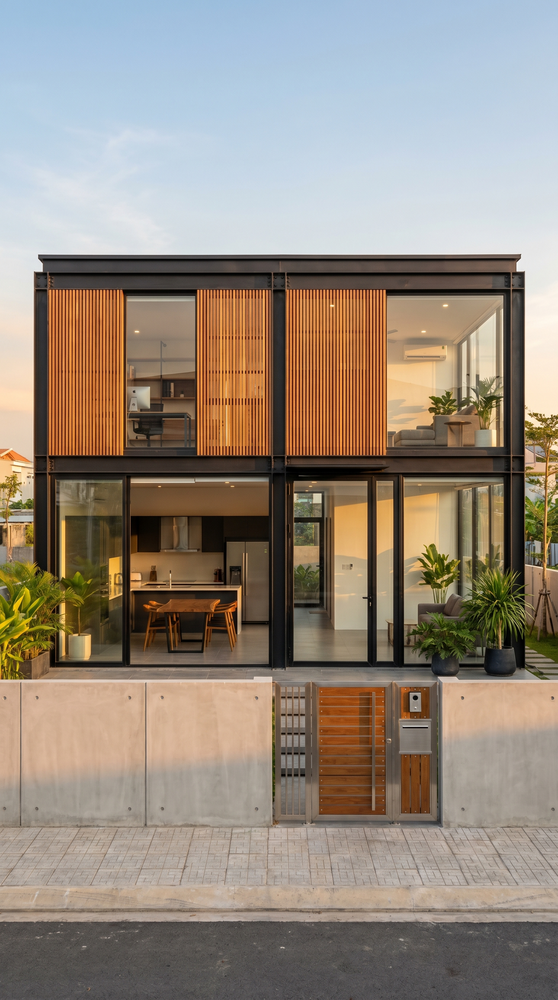
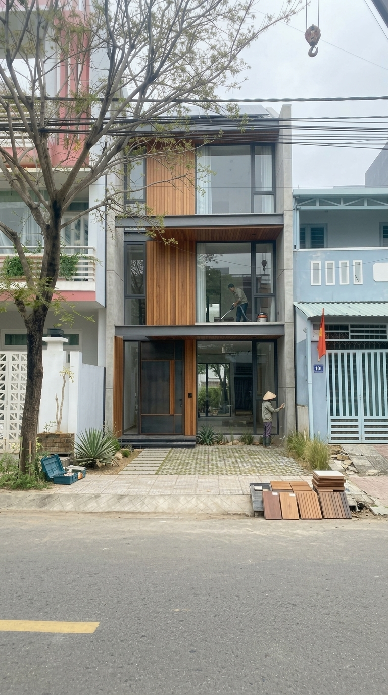

# Digital Content & Social Media Portfolio

Content creation, visual storytelling, video editing, and marketing communication projects developed using Canva, CapCut, Adobe Premiere Pro, and AI-assisted workflows.

---

## Overview

This portfolio showcases projects focused on content creation, visual communication, and marketing storytelling across business presentations and promotional video content.

### Skills Demonstrated

- Content Creation
- Video Editing
- Visual Storytelling
- Marketing Communications
- Business Communication
- Presentation Design
- Audience Engagement
- Brand Communication

---

# Project 1: Creator VN Corporate Profile & Brand Presentation

## Objective

Design a professional corporate profile to communicate company capabilities, manufacturing expertise, featured projects, and brand positioning.

## Tools Used

- Canva
- Generative AI Tools

## Skills Demonstrated

- Business Communication
- Content Development
- Presentation Design
- Information Organization
- Brand Communication

## Project Highlights

- Developed a professional corporate profile presentation for a furniture manufacturing company.
- Organized company information into a clear and visually consistent format.
- Presented company capabilities, production processes, featured projects, and business value propositions through visual storytelling.

---

# Project 2: Steel House Transformation Video – Tropical Villa Concept

## Objective

Create promotional content showcasing the transformation from an empty lot into a modern steel-frame residential property in a tropical setting.

## Tools Used

- Generative AI Tools
- CapCut
- Canva

## Skills Demonstrated

- Video Editing
- Content Creation
- Marketing Communications
- Visual Storytelling

## Project Highlights

- Produced short-form promotional content highlighting modern steel-frame housing concepts.
- Used AI-assisted workflows to generate visual assets and support content development.
- Focused on showcasing finished design outcomes through transformation-based storytelling.

### Video Demo

🎥 Watch the YouTube Short:
https://youtube.com/shorts/kNpmHxFLMfI?feature=share

---

# Project 3: Steel House Transformation Video – Urban Residential Concept

## Objective

Create short-form marketing content illustrating the construction and completion of a modern steel-frame home in an urban environment.

## Tools Used

- Generative AI Tools
- CapCut
- Canva

## Skills Demonstrated

- Content Creation
- Video Editing
- Audience Engagement
- Visual Storytelling

## Project Highlights

- Developed promotional content targeted toward urban residential housing audiences.
- Combined AI-generated visuals with editing workflows to create engaging marketing content.
- Emphasized architectural design, functionality, and modern living spaces.

### Video Demo

🎥 Watch the YouTube Short:
https://youtube.com/shorts/AYC8hiqTA4k?feature=share

---

# Project 4: Steel House Construction Process Visualization

## Objective

Develop visual content that communicates the progression of steel-frame house construction through engaging transformation-focused storytelling.

## Tools Used

- Generative AI Tools
- CapCut
- Canva

## Skills Demonstrated

- Marketing Communications
- Video Editing
- Content Creation
- Visual Storytelling

## Project Highlights

- Created content illustrating construction progress and steel-frame building concepts.
- Focused on simplifying complex construction information through visual communication.
- Supported marketing efforts by demonstrating construction workflows and project outcomes.

### Video Demo

Coming Soon

---

## Tools & Platforms

### Design & Content Creation

- Canva
- CapCut
- Adobe Premiere Pro
- Generative AI Tools

### Marketing & Analytics

- Google Analytics 4 (GA4)
- Excel
- SQL
- Power BI

---

## Contact

LinkedIn:
https://www.linkedin.com/in/tbdp138/

GitHub:
https://github.com/tbdp13895
